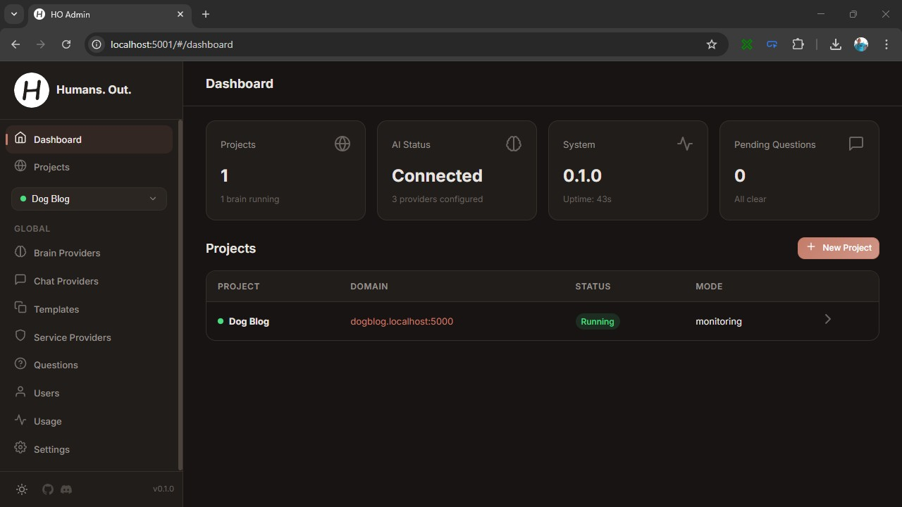
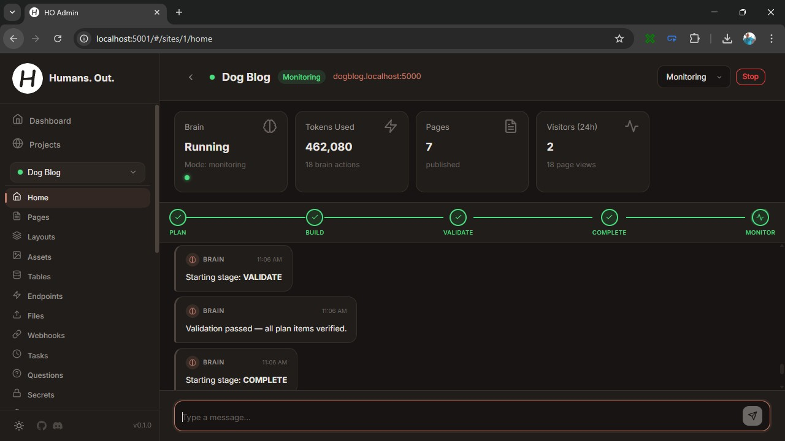

# HO (Humans. Out.)

**One binary. Describe what you want. Done.**

HO autonomously builds, deploys, and monitors web(sites/apps/games).

No Docker. No npm. No database server. No webserver. No build steps. Just run it.

Also, your data stays on your server/computer. Nothing gets hosted in the cloud.





---

## Quick Start

Download from **[Releases](https://github.com/markdr-hue/HO/releases)**, run the binary, open `http://localhost:5001`.
The setup wizard handles the rest in ~2 minutes. Your project is served at `http://localhost:5000`.

```bash
# Linux / macOS
chmod +x ./ho && ./ho

# Windows
.\ho.exe
```

## The Pipeline

Every project goes through the same deterministic build process:

| Stage | What Happens |
|---|---|
| **PLAN** | Analyzes your description, asks clarifying questions if needed, produces a structured Plan (pages, endpoints, tables, design system) |
| **BUILD** | Single LLM session: creates all tables, endpoints, CSS, layout, JS, and pages. Dynamic iteration budget scales with plan complexity |
| **VALIDATE** | Verifies every plan item was actually created. Auto-fixes missing items. Runs design consistency review |
| **COMPLETE** | Switches to monitoring mode |
| **MONITORING** | Adaptive health checks (5-15 min), investigates and self-heals issues |

Updates use **UPDATE_PLAN**, which patches only affected parts of the plan, then re-enters BUILD.

---

## Features

### AI & Autonomy
HO watches over your project from first idea to going live. It builds, fixes, and improves without you needing to touch code.

- **Autonomous building** - describe what you want (site, webapp, SPA, multiplayer game, dashboard). HO plans, designs, codes, and deploys it
- **Human-in-the-loop** - asks clarifying questions when your description is vague, pauses until you answer
- **Incremental updates** - tell HO what to change via chat, only affected parts get rebuilt
- **Self-healing monitoring** - checks your project's health every few minutes and automatically fixes issues it finds
- **Crash recovery** - if interrupted, picks up exactly where it left off
- **Persistent memory** - remembers your preferences, past decisions, and context across conversations
- **Post-build validation** - checks every planned item was actually built, tests endpoints, reviews design consistency

### Database
Every project gets its own isolated database. Tables, columns, and data are created on the fly based on your description. (SQLite per project)

- **Secure columns** - passwords are automatically hashed, sensitive fields automatically encrypted (bcrypt, AES-256-GCM)
- **Foreign keys** - link tables together with enforced relationships so your data stays consistent (REFERENCES constraints)
- **Full-text search** - make any text column instantly searchable with advanced query support like phrases and wildcards (FTS5)
- **Indexes** - speed up queries on frequently filtered columns (B-tree, UNIQUE)
- **CSV import/export** - bulk load data in or pull it out as spreadsheets
- **Raw SQL queries** - run custom read queries when the built-in filters aren't enough (SELECT with joins, subqueries)

### APIs
Every table can be exposed as a ready-to-use API with one command, no code needed. (REST endpoints with JSON responses)

- **Auto-generated CRUD** - create, read, update, delete operations with filtering, sorting, pagination, and field selection
- **Aggregation** - count, sum, average, min, max with optional grouping (GROUP BY)
- **Row-level security** - each user only sees their own data, admins see everything (owner_column scoping)
- **Role-based access** - restrict endpoints to specific user roles like "admin" or "editor" (RBAC)
- **Response caching** - frequently read endpoints serve cached results for faster response times, automatically cleared when data changes (in-memory TTL cache)
- **Per-endpoint rate limiting** - control how many requests each user can make per minute
- **Custom CORS** - configure which external sites can call your API (cross-origin resource sharing)
- **Auto-generated documentation** - interactive API explorer page created automatically (OpenAPI/Swagger UI)

### Authentication
User accounts, login, registration, and access control. All built-in and ready to go. (JWT-based auth)

- **Login & registration** - email/password with automatic password hashing
- **Token refresh** - users stay logged in without re-entering credentials (JWT refresh endpoint)
- **Social login** - sign in with Google, GitHub, Discord, or any custom provider (OAuth 2.0)
- **Configurable roles** - assign roles like "user", "admin", "editor" with a default for new signups
- **Encrypted secrets** - API keys and credentials stored safely, never exposed in plain text (AES-256-GCM)

### AI-Powered Endpoints
Give your project its own AI features like chatbots, writing assistants, and content generators, powered by the same AI that built it. (LLM endpoints)

- **Streaming chat** - real-time word-by-word responses for chatbots and assistants (Server-Sent Events)
- **One-shot completion** - full response in one go for generators, classifiers, and tools (JSON response)
- **Server-side prompts** - define the AI's personality and rules, never visible to visitors
- **Conversation history** - configurable memory so the AI remembers what was said earlier
- **Configurable** - control response length, creativity, rate limits, and auth requirements per endpoint

### Real-Time
Live, instant communication between your app and its users. No page refresh needed.

- **WebSockets** - two-way messaging with chat rooms, join/leave notifications, and direct messages
- **Server-Sent Events** - one-way server-to-browser streaming for live feeds and notifications (SSE)
- **Server-side push** - backend events (new data, payments, etc.) can instantly broadcast to connected users via WebSocket (ws_broadcast actions)
- **File uploads** - users can upload files with type validation, size limits, and optional auto-save to database (multipart)

### Payments
Accept payments and manage subscriptions with popular providers. No payment code to write.

- **Checkout flows** - one-time payments with Stripe, PayPal, Mollie, Square, or any REST-based provider
- **Subscriptions** - recurring billing with plans, trial periods, and cancellation handling
- **Webhook verification** - payment confirmations are cryptographically verified to prevent fraud (HMAC-SHA256)

### Email
Send emails to your users. Welcome messages, confirmations, notifications, receipts.

- **Multiple providers** - SendGrid, Mailgun, Resend, Amazon SES, or any REST-based email service
- **Reusable templates** - design email layouts once and fill in the details dynamically (`{{variable}}` substitution)

### Automation
Things that happen automatically when events occur. No manual intervention, no AI needed at runtime.

- **Event-driven actions** - when something happens (user registers, order placed, file uploaded), automatically send emails, call APIs, update data, broadcast to WebSockets, run SQL, or queue background work
- **35+ event types** - auth, data changes, payments, file uploads, page updates, schema changes, scheduled task results, and more
- **Scheduled tasks** - run things on a timer: every hour, every day at 9am, first Monday of each month (cron expressions)
- **Background jobs** - queue up work to run later with automatic retry on failure (exponential backoff)
- **Webhooks** - receive data from external services or send data out when events happen, with signature verification (HMAC-SHA256)
- **Audit logging** - security-relevant events (logins, data changes, payments, config changes) automatically recorded

### Content & Pages
Everything your users see. Pages, images, reusable blocks, and the tools to manage them.

- **Version history** - every page, file, and layout change is saved with full rollback to any previous version
- **Reusable components** - create HTML blocks once, include them across multiple pages with `{{include:name}}` syntax
- **Parameterized routes** - dynamic pages like `/product/:id` that load different content based on the URL
- **Image processing** - resize, create thumbnails, and optimize images automatically (JPEG/PNG)
- **Progressive Web App** - one-click PWA setup so your project works like a native app on phones (manifest.json, service worker)
- **URL redirects** - send users from old URLs to new ones (301/302 redirects)

### SEO
Help search engines find and understand your project. Meta tags, sitemaps, and structured data, all managed automatically.

- **Meta tags** - title, description, and keywords per page
- **Social sharing** - control how your project looks when shared on social media (Open Graph)
- **Structured data** - tell search engines exactly what your content is (JSON-LD)
- **Sitemap & robots.txt** - auto-generated from your published pages
- **SEO validation** - scans all pages and flags missing essentials
- **Canonical URLs** - prevent duplicate content issues

### Analytics & Monitoring
See how your project is doing. Who's visiting, what's popular, and whether anything is broken.

- **Built-in analytics** - page views, unique visitors, top pages, referrers, daily and weekly trends
- **System diagnostics** - health checks for memory, database, and overall system performance
- **AI cost tracking** - see how many tokens each AI call uses, with detailed logs and export
- **Integrity checks** - scan for broken references, missing files, and orphaned data

### Hosting & Deployment
One binary, no setup, runs anywhere. Your data stays on your machine.

- **Single binary** - no Docker, no npm, no database server, no webserver to configure. Just run it
- **Free HTTPS** - point your domain, get automatic SSL certificates (Let's Encrypt via Caddy)
- **Multi-project** - run unlimited projects from one instance, each fully isolated with its own database and files
- **Multi-platform** - Linux, macOS (Intel & Apple Silicon), Windows
- **Custom domains** - each project gets its own domain with automatic routing

### Integrations
Connect HO to the outside world. External APIs, messaging bots, and file storage.

- **Telegram bot** - manage your projects, check status, view logs, trigger builds, and chat. All from Telegram
- **External API providers** - connect any REST API with stored credentials and make authenticated requests
- **File storage** - user-uploaded files tracked with metadata and public URLs (blob storage)

---

## LLM Providers

| Provider | Type | Notes |
|---|---|---|
| Anthropic Claude | anthropic | Sonnet, Haiku, Opus (with prompt caching) |
| Any OpenAI-compatible | openai | Ollama (local/free), Z.ai, OpenRouter, Groq, Gemini, etc. |

Providers are configured through the setup wizard or `seed.json`.

---

## Configuration

HO works with zero configuration out of the box. Optionally use `config.json` or environment variables with the `HO_` prefix:

| Variable | Default | Description |
|---|---|---|
| `HO_ADMIN_PORT` | 5001 | Admin panel port |
| `HO_PUBLIC_PORT` | 5000 | Public site port |
| `HO_DATA_DIR` | ./data | Data directory |
| `HO_CADDY_ENABLED` | false | Enable embedded Caddy for HTTPS |
| `HO_CORS_ORIGINS` | | Comma-separated allowed origins |
| `HO_RATE_LIMIT_RATE` | | Requests per second per IP |
| `HO_RATE_LIMIT_BURST` | | Burst size for rate limiter |
| `HO_LOG_LEVEL` | info | Log level (debug, info, warn, error) |
| `HO_LLM_TIMEOUT_SEC` | 420 | LLM call timeout |

JWT secrets and encryption keys are auto-generated on first run.

---

## Production HTTPS

Point your domain's DNS to your server, set the domain in the admin panel, set `HO_CADDY_ENABLED=true`, and restart. Caddy automatically gets a free SSL certificate from Let's Encrypt. Make sure ports 80 and 443 are open.

---

## Build From Source

```bash
# Requires Go 1.25+
git clone https://github.com/markdr-hue/HO.git
cd HO

make build          # Build for your platform
make build-linux    # Linux AMD64 + ARM64
make build-darwin   # macOS Intel + Apple Silicon
make build-windows  # Windows AMD64
make build-all      # Cross-compile everything
make dev            # Run in development mode
```

---

## Security

The admin panel runs on port **5001**. If your server is publicly accessible, block this port externally and use an SSH tunnel (`ssh -L 5001:localhost:5001 user@yourserver`) to access it securely.

---

## Warning

- This is for **testing and experimentation**. Not production. Probably.
- There will be errors, trust me
- HO is not responsible for unemployment

---

## Community

- **Discord** : https://discord.gg/VRdYgDQ2qr
- **X / Twitter** : https://x.com/humans_out_mark
- **GitHub** : https://github.com/markdr-hue/HO

---

## Special thanks

HO's seamless hosting and HTTPS experience wouldn't exist without these two incredible projects:

- **[Caddy](https://caddyserver.com/)** The web server powering this HO. Zero config, zero hassle, just works.
- **[Let's Encrypt](https://letsencrypt.org/)** Free SSL certificates for everyone, thank you.

These projects embody the same spirit HO strives for: powerful things should be simple. Thank you for making the internet a better place.

---

## About Me

- Full-time single dad of 3 with a fullt-time job to match that
- If you have mental problems try to seek help, most are fixable
- Be yourself, don't let anyone decide what to do or think
- Remember, most people are unaware of the system they live in and go to great lengths to defend it

---

## License

MIT
